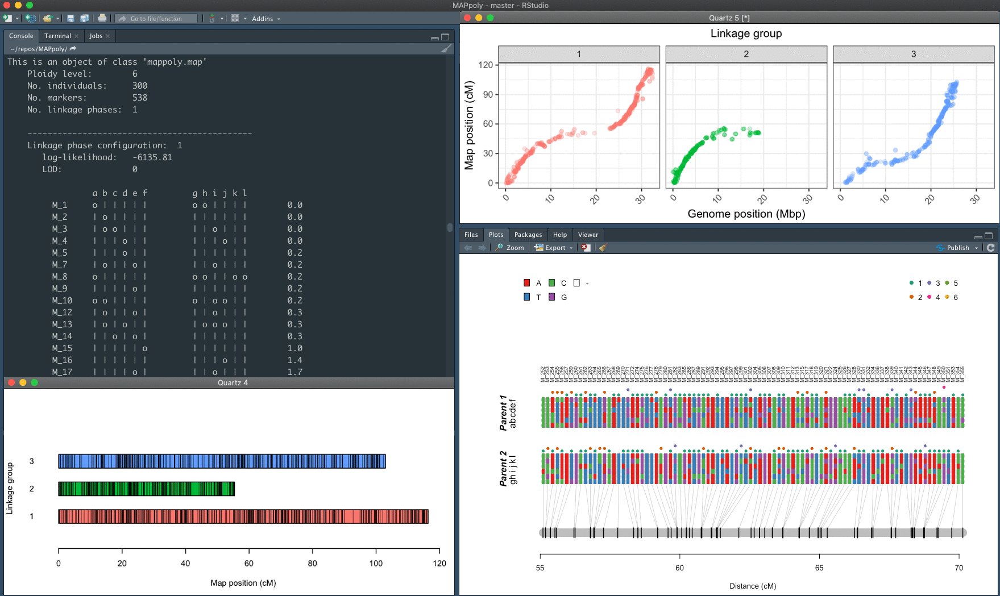

[](https://travis-ci.org/mmollina/MAPpoly) [](https://img.shields.io/badge/development-active-blue.svg)
[](https://www.gnu.org/licenses/gpl-3.0)

# Introduction

MAPpoly (v. 0.1.0) is an under development R package to construct genetic maps in autopolyploids with even ploidy levels. In its current version, MAPpoly can handle ploidy levels up to 8 when using hidden Markov models (HMM), and up to 12 when using the two-point simplification. All the two-point based functions are fast enough to run on standard computers. However, we strongly recommend to use high-performance computation for HMM-based analysis, especially for ploidy levels higher than 4. 




In its current version, MAPpoly can handle three different types of datasets:

1. CSV files 
2. MAPpoly files
  - Dosage based
  - Probability based
3. VCF files (beta)

The derivation of the HMM used in MAPpoly can be found in [Mollinari and Garcia, 2019](https://doi.org/10.1534/g3.119.400378). Recently, we used MAPpoly to built an ultra-dense multilocus integrated genetic map containing ~30k SNPs and characterized the inheritance system in a sweetpotato full-sib family ([Mollinari et al., 2020](https://doi.org/10.1534/g3.119.400620)). See the resulting map [here](https://gt4sp-genetic-map.shinyapps.io/bt_map/) and the haplotype composition of all individuals in the full-sib population [here](https://gt4sp-genetic-map.shinyapps.io/offspring_haplotype_BT_population/).

MAPpoly is not available from CRAN, but you can install it from Git Hub. Within R, you need to install and load the package `devtools`:

```R
install.packages("devtools")
```

If you are using Windows, you must install the the latest recommended version of [Rtools](https://cran.r-project.org/bin/windows/Rtools/).

To install MAPpoly from Git Hub use

```R
devtools::install_github("mmollina/mappoly")
```

For further QTL analysis, we recommend our [QTLpoly](https://github.com/guilherme-pereira/QTLpoly) package. QTLpoly is an under development software to map quantitative trait loci (QTL) in full-sib families of outcrossing autopolyploid species based on a random-effect multiple QTL model [Pereira et al. 2019](https://www.biorxiv.org/content/10.1101/622951v1). 

# Vignettes

* [Building a genetic map in an hexaploid full-sib population using MAPpoly](https://mmollina.github.io/tutorials/hexa_fake/haxaploid_map_construction.html)
* [Building a genetic map using potato genotype data from SolCAP](https://mmollina.github.io/MAPpoly_vignettes/vignette_tetraploid/vignette_tetraploid.html)
* Dataset examples
  * [Hexaploid sweetpotato VCF dataset (Beauregard  x Tanzania) obtained using SM2VCF](https://github.com/mmollina/MAPpoly_vignettes/tree/master/data/BT)
  * [Hexaploid simulation with dosage call in MAPpoly format](https://github.com/mmollina/tutorials/blob/master/datasets/hexafake)
  * [Hexaploid simulation with dosage probabilities in MAPpoly format](https://github.com/mmollina/tutorials/blob/master/datasets/hexafake_geno_dist)
  * [Tetraploid potato with dosage call in MAPpoly format](https://github.com/mmollina/tutorials/blob/master/datasets/SolCAP_dosage)
  * [Tetraploid potato with dosage call in CSV format](https://github.com/mmollina/tutorials/blob/master/datasets/tetra_solcap.csv)
  * [Tetraploid potato with dosage probabilities in MAPpoly format](https://github.com/mmollina/tutorials/blob/master/datasets/SolCAP)
  
# Acknowledgment 

This package has been developed as part of the [Genomic Tools for Sweetpotato Improvement project](https://sweetpotatogenomics.cals.ncsu.edu/) (GT4SP), funded by [Bill & Melinda Gates Foundation](https://www.gatesfoundation.org/).
